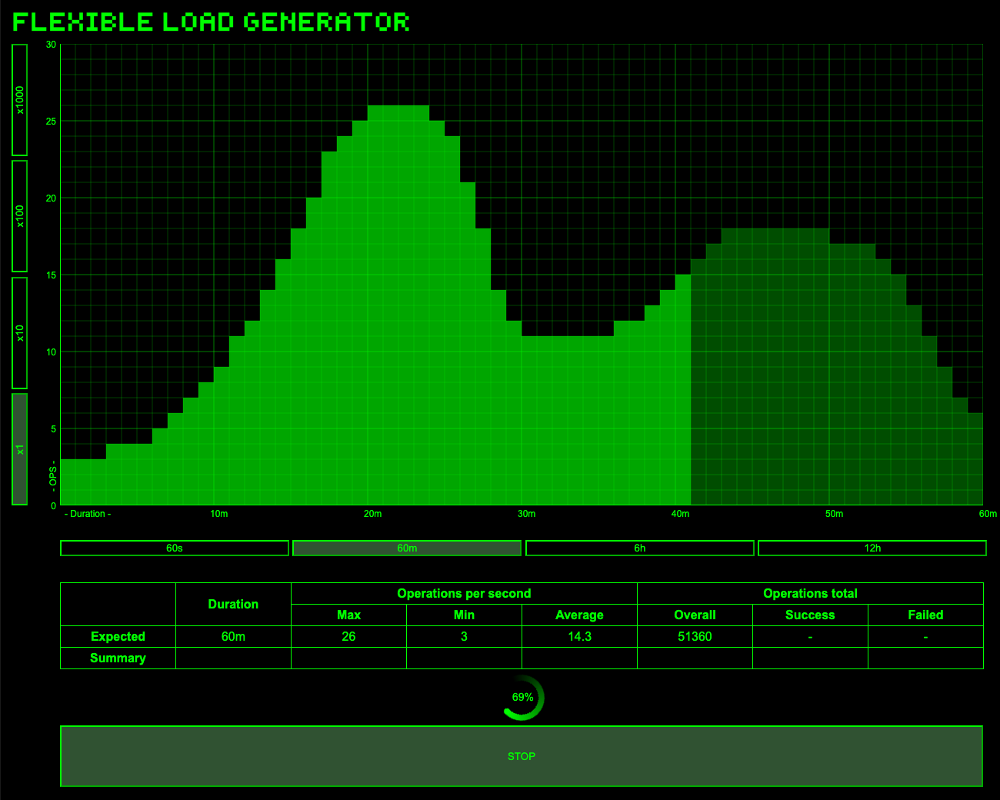

# Introduction

The project is a library for flexible load generating.



# System requirements

- JDK 11
- Gradle
- Spring Boot

# Working principles

The application allows you to generate load dynamically, according to the load profile set by the user. the load profile is set by the user through the UI interface by drawing a load graph on the coordinate grid.

The generator is working by cycles, with a 1-second cycle time, according to a given load profile. The work performed by the generator is described in a methods of `LoadGeneratorJob` interface. This interface provides following methods:
- `onEach()` This method describes the basic unit of the work;
- `onStart()` This method is called once before starting load profile work;
- `onFinish()` This method is called once upon completion of the load profile work. 
  
The `onEach()` method is the main unit of work for a generator. It reflects the quantitative indicator of the load (operations per second). Other methods are used to perform additional flexible tasks (preparation tasks, warming up, aggregating operations, etc.), or for support tasks (logging, statistics, etc.).

# Quick start

## Dependency

If you are using Gradle in your app you can add library as dependency following next steps:
1) Add to `settings.gradle` additional source mapping
```
sourceControl {
    gitRepository("https://github.com/stroiker/flexible-load-generator.git") {
        producesModule("me.stroiker:flexible-load-generator")
    }
}
```
2) Add to `build.gradle` library dependency
```
dependencies {
    ...
    implementation "me.stroiker:flexible-load-generator:${version}"
}
```
3) Run Gradle task `assemble` to generate source classes.

Example of app with library you can find here https://github.com/stroiker/flexible-load-generator-example

## Configuration

Generator configuration managed by auto-configuration mode inside Spring Boot framework context. To get started you need to add this library to your app classpath.
Then you have to annotate any bean with `@LoadGeneratorAutoConfiguration` annotation, then implement the `LoadGeneratorJob` interface. Your implementation must be Spring bean;

## Creating a load profile

To start working with the generator web UI, you need to launch the application. The generator UI page is opened at `http://localhost:8080`.
This page provides elements for creating and managing a load profile.
To create a load profile, you need to press the left mouse button inside the coordinate grid and drag the cursor, drawing the required load profile, 
in accordance with the OPS (y scale) and time (x scale) scales. You can also adjust the scaling of each scale with the corresponding buttons.
After you chose load profile you can start generator by `START` button.

